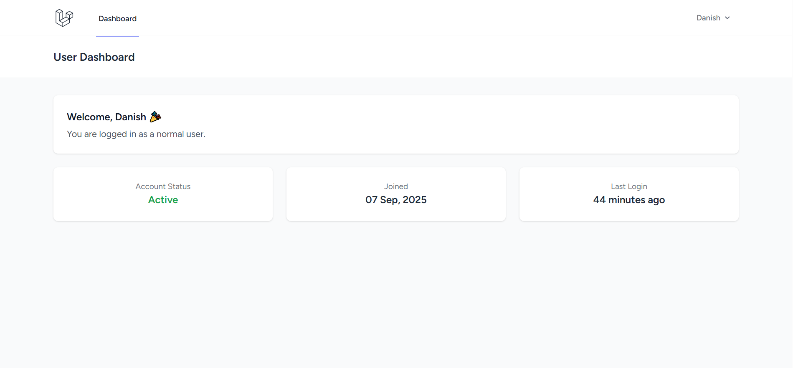
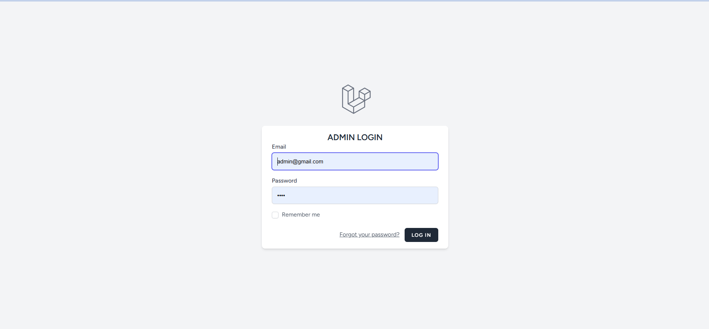
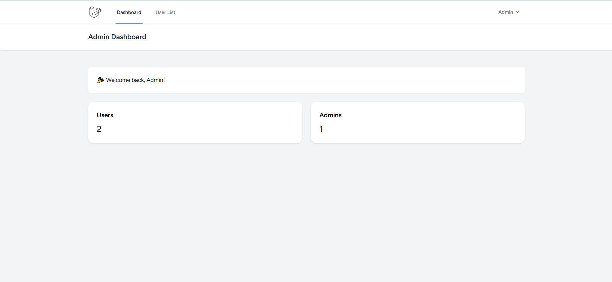

# 🔐 Multi-User Authentication System  
*(Laravel Breeze + MySQL)*  

  
  
  
  

---

## 📖 Overview
This project is a **role-based multi-user authentication system** built with **Laravel Breeze** and **MySQL**.  
It includes **separate dashboards** for **Users** and **Admins** with different privileges.  

---

## 🚀 Features

### 👤 User
- View and update profile (name, email, password).  
- Logout anytime.  
- Access a personalized dashboard with **last login time**.  

### 🕵️ Guest
- Register to create a new account.  
- Login to access the user dashboard.  

### 🛠️ Admin
- Access **Admin Dashboard** with:  
  - Last login time  
  - Total number of users  
- Delete any user anytime.  
- View profile & logout.  

---

## 🔑 Default Login Credentials

**User Account**
```
Email: danish@gmail.com
Password: 12345678
```

**Admin Account**
```
Email: admin@gmail.com
Password: 1234
```

---

## ⚙️ Installation Guide

### 1️⃣ Clone the Repository
```bash
git clone https://github.com/your-username/multi-user-auth-system.git
cd multi-user-auth-system
```

### 2️⃣ Install Dependencies
```bash
composer install
npm install
```

### 3️⃣ Configure Environment
- Copy `.env.example` to `.env`
```bash
cp .env.example .env
```
- Update DB credentials in `.env` file.

### 4️⃣ Run Migrations & Seed Data
```bash
php artisan migrate
php artisan db:seed
```

### 5️⃣ Compile Frontend Assets
```bash
npm run dev
```

### 6️⃣ Start Development Server
```bash
php artisan serve
```

Now visit: **http://127.0.0.1:8000**

---

## 🗄️ Database
- MySQL database file is included in the **outer project folder** for quick setup.  

---

## 📸 Screenshots

> Replace below with your actual images (store in `/screenshots` folder).  

### 🔑 User Login Page  
  

### 📊 User Dashboard  
  

### 🛠️ Admin Login  
  

### 🛠️ Admin Dashboard  
  

---

## 📜 License
This project is released under the [MIT License](LICENSE).  

---

## 💡 Author
👨‍💻 Developed by **Danish**  
📧 Contact: [Your Email Here]  
