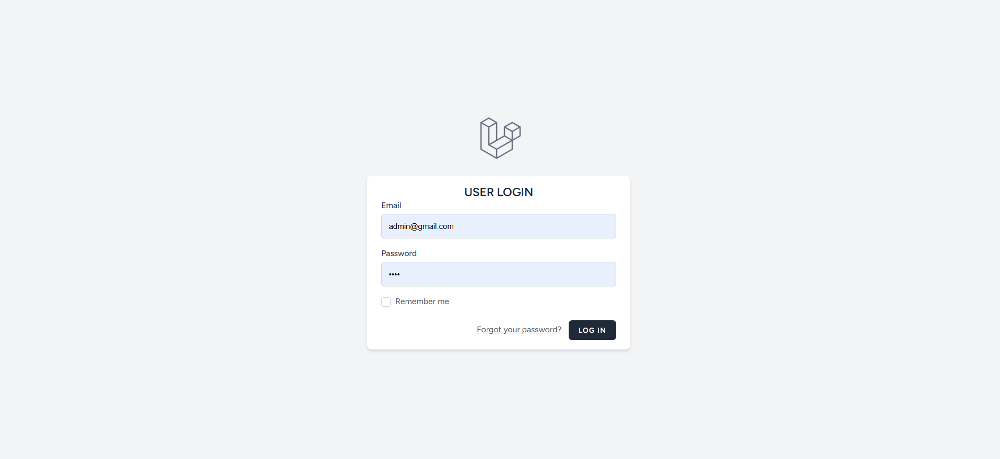

# 🔐 Multi-User Authentication System  
*(Laravel Breeze + MySQL)*  

  
  
  
  

---

## 📖 Overview
This project is a **role-based multi-user authentication system** built with **Laravel Breeze** and **MySQL**.  
It includes **separate dashboards** for **Users** and **Admins** with different privileges.  

---

## 🚀 Features

### 👤 User
- View and update profile (name, email, password).  
- Logout anytime.  
- Access a personalized dashboard with **last login time**.  

### 🕵️ Guest
- Register to create a new account.  
- Login to access the user dashboard.  

### 🛠️ Admin
- Access **Admin Dashboard** with:  
  - Last login time  
  - Total number of users  
- Delete any user anytime.  
- View profile & logout.  

---

## 🔑 Default Login Credentials

**User Account**
```
Email: danish@gmail.com
Password: 12345678
```

**Admin Account**
```
Email: admin@gmail.com
Password: 1234
```

---

## ⚙️ Installation Guide

### 1️⃣ Clone the Repository
```bash
git clone https://github.com/your-username/multi-user-auth-system.git
cd multi-user-auth-system
```

### 2️⃣ Install Dependencies
```bash
composer install
npm install
```

### 3️⃣ Configure Environment
- Copy `.env.example` to `.env`
```bash
cp .env.example .env
```
- Update DB credentials in `.env` file.

### 4️⃣ Run Migrations & Seed Data
```bash
php artisan migrate
php artisan db:seed
```

### 5️⃣ Compile Frontend Assets
```bash
npm run dev
```

### 6️⃣ Start Development Server
```bash
php artisan serve
```

Now visit: **http://127.0.0.1:8000**

---

## 🗄️ Database
- MySQL database file is included in the **outer project folder** for quick setup.  

---

## 📸 Screenshots


### 🔑 User Login Page  
  

### 📊 User Dashboard  
  

### 🛠️ Admin Login  
  

### 🛠️ Admin Dashboard  
  


---

## 💡 Author
👨‍💻 Developed by **Danish**  
  
=======
<p align="center"><a href="https://laravel.com" target="_blank"></a></p>

<p align="center">
<a href="https://github.com/laravel/framework/actions"></a>
<a href="https://packagist.org/packages/laravel/framework"></a>
<a href="https://packagist.org/packages/laravel/framework"></a>
<a href="https://packagist.org/packages/laravel/framework"></a>
</p>

## About Laravel

Laravel is a web application framework with expressive, elegant syntax. We believe development must be an enjoyable and creative experience to be truly fulfilling. Laravel takes the pain out of development by easing common tasks used in many web projects, such as:

- [Simple, fast routing engine](https://laravel.com/docs/routing).
- [Powerful dependency injection container](https://laravel.com/docs/container).
- Multiple back-ends for [session](https://laravel.com/docs/session) and [cache](https://laravel.com/docs/cache) storage.
- Expressive, intuitive [database ORM](https://laravel.com/docs/eloquent).
- Database agnostic [schema migrations](https://laravel.com/docs/migrations).
- [Robust background job processing](https://laravel.com/docs/queues).
- [Real-time event broadcasting](https://laravel.com/docs/broadcasting).

Laravel is accessible, powerful, and provides tools required for large, robust applications.
